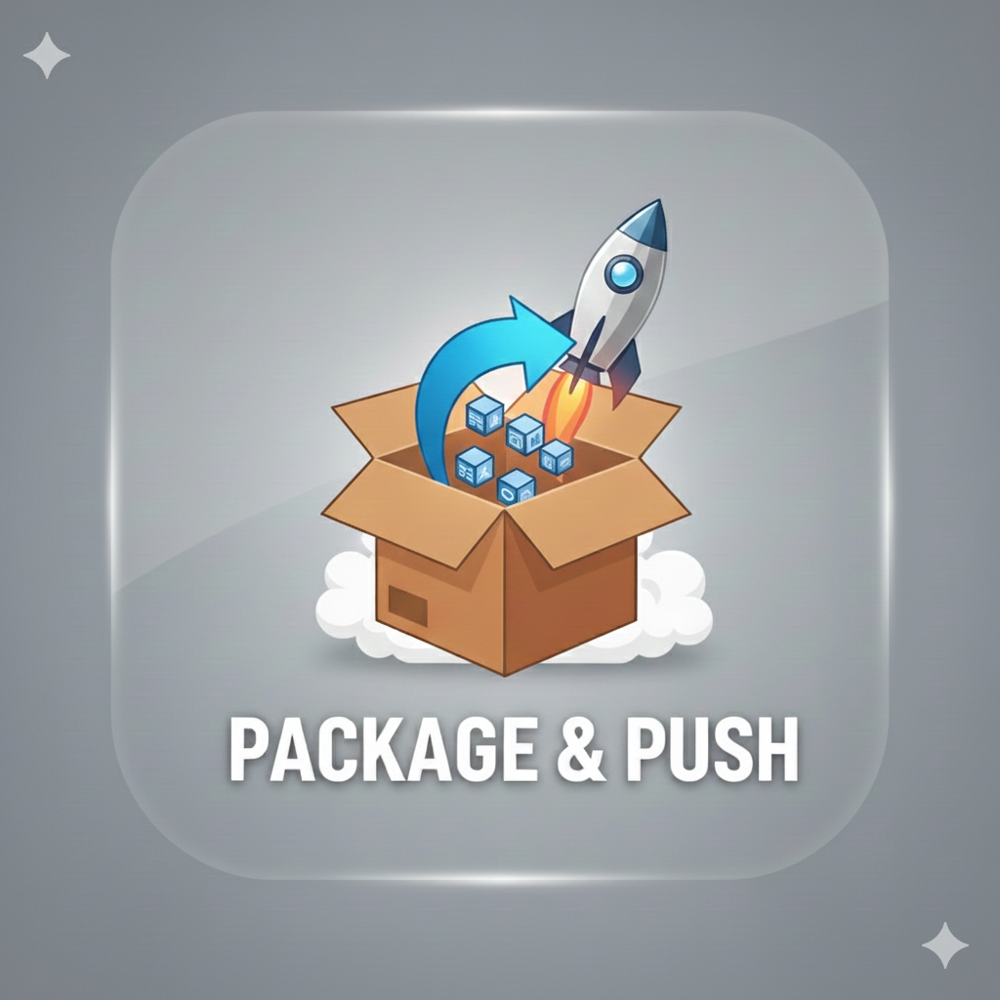

<div align="center">
  
  <h1>Package & Push</h1>
  <p>A native macOS application for building macOS packages from Homebrew formulas and deploying them to Microsoft Intune.</p>
</div>

## Features

- 🔍 **Search Homebrew Packages**: Browse and search Homebrew formulas
- 📦 **Build macOS Packages**: Automatically build `.pkg` installers from Homebrew formulas
- 🚀 **Deploy to Intune**: Upload packages directly to Microsoft Intune with full configuration
- 🔐 **Azure AD Integration**: Authenticate with Microsoft Entra ID and manage group assignments
- 📋 **App Configuration**: Configure app metadata, requirements, detection rules, and assignments
- 🔄 **Version Management**: Automatically detect existing apps and handle version updates
- ✅ **Assignment Preservation**: Automatically fetch and preserve existing group assignments during updates

## Requirements

- macOS 12.0 or later
- Xcode 14.0 or later
- Microsoft Entra ID account with Intune permissions
- Homebrew installed

## Installation

### From Source

1. Clone the repository:
```bash
git clone https://github.com/pathaksomesh06/Package-Push.git
cd Package-Push
```

2. Open the project in Xcode:
```bash
open Package&Push.xcodeproj
```

3. Build and run the project (⌘R)

### From Package

Download the latest `.pkg` installer from the [Releases](https://github.com/pathaksomesh06/Package-Push/releases) page.

## Screenshots

### Main Screen 
Welcome screen with Microsoft Entra ID authentication


### Package Search
Search and browse Homebrew packages with real-time filtering


### Package Details
View package information including version, homepage, and build status


### App Configuration
Configure app metadata, requirements, detection rules, and assignments


### Deployment Progress
Real-time progress tracking during package upload to Intune


### Version Update Detection
Automatic detection of existing apps with version update confirmation


### Success Screen
Deployment completion with app details and assignment summary


## Usage

1. **Launch the Application**: Open Package & Push from Applications
2. **Sign In**: Authenticate with your Microsoft Entra ID account
3. **Search for Packages**: Use the search bar to find Homebrew packages
4. **Build Package**: Select a package and click "Build Package"
5. **Configure App**: Fill in app details, requirements, and assignments
6. **Deploy to Intune**: Click "Deploy to Intune" to upload the package

## Features in Detail

### Package Building
- Automatically extracts Homebrew formulas
- Builds signed `.pkg` installers
- Handles dependencies and requirements

### Intune Integration
- Creates macOS LOB (Line of Business) apps
- Configures app metadata and properties
- Sets up detection rules
- Manages group assignments (Required/Available)
- Handles version updates with assignment preservation

### Assignment Management
- Supports Azure AD group assignments
- Handles "All Users" and "All Devices" assignments
- Automatically fetches existing assignments during updates
- Preserves assignments when updating app versions

## Architecture

- **SwiftUI**: Modern declarative UI framework
- **MSAL (Microsoft Authentication Library)**: Azure AD authentication
- **Microsoft Graph API**: Intune and Azure AD integration
- **Homebrew API**: Package information and formula access

## Project Structure

```
Package&Push/
├── Package&Push/          # Main application code
│   ├── AuthenticationManager.swift
│   ├── IntuneMobileAppUploader.swift
│   ├── HomebrewManager.swift
│   ├── PackageBuilder.swift
│   └── ...
├── Package&Push.xcodeproj/
└── README.md
```

## Configuration

The app uses `Config.plist` for configuration. Key settings include:
- Microsoft Graph API endpoint
- Azure AD tenant configuration
- App-specific settings

## Troubleshooting

See [TROUBLESHOOTING.md](TROUBLESHOOTING.md) for common issues and solutions.

## Contributing

Contributions are welcome! Please feel free to submit a Pull Request.

## License

This project is licensed under the MIT License - see the LICENSE file for details.

## Author

**Somesh Pathak**
- GitHub: [@pathaksomesh06](https://github.com/pathaksomesh06)
- Blog: [Intune in Real Life](https://intuneinreallife.com)
- Microsoft MVP: Enterprise Mobility

## Acknowledgments

- Microsoft Intune team for the Graph API
- Homebrew project for package management
- SwiftUI and Apple frameworks

## Related Projects

- [MISA](https://github.com/pathaksomesh06/MISA) - macOS Intune Support Assistant
- [ABMate](https://github.com/pathaksomesh06/ABMate) - Apple Business Manager client
- [Intune-Log-Reader](https://github.com/pathaksomesh06/Intune-Log-Reader) - Intune log analysis tool

